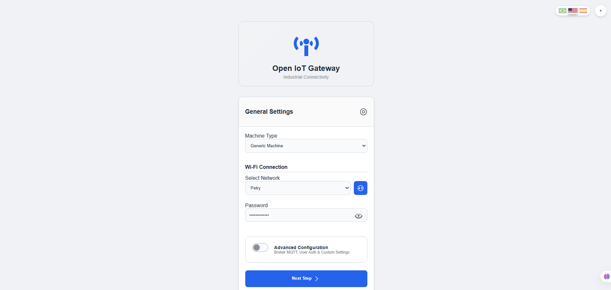
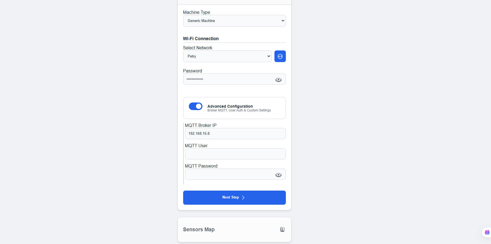
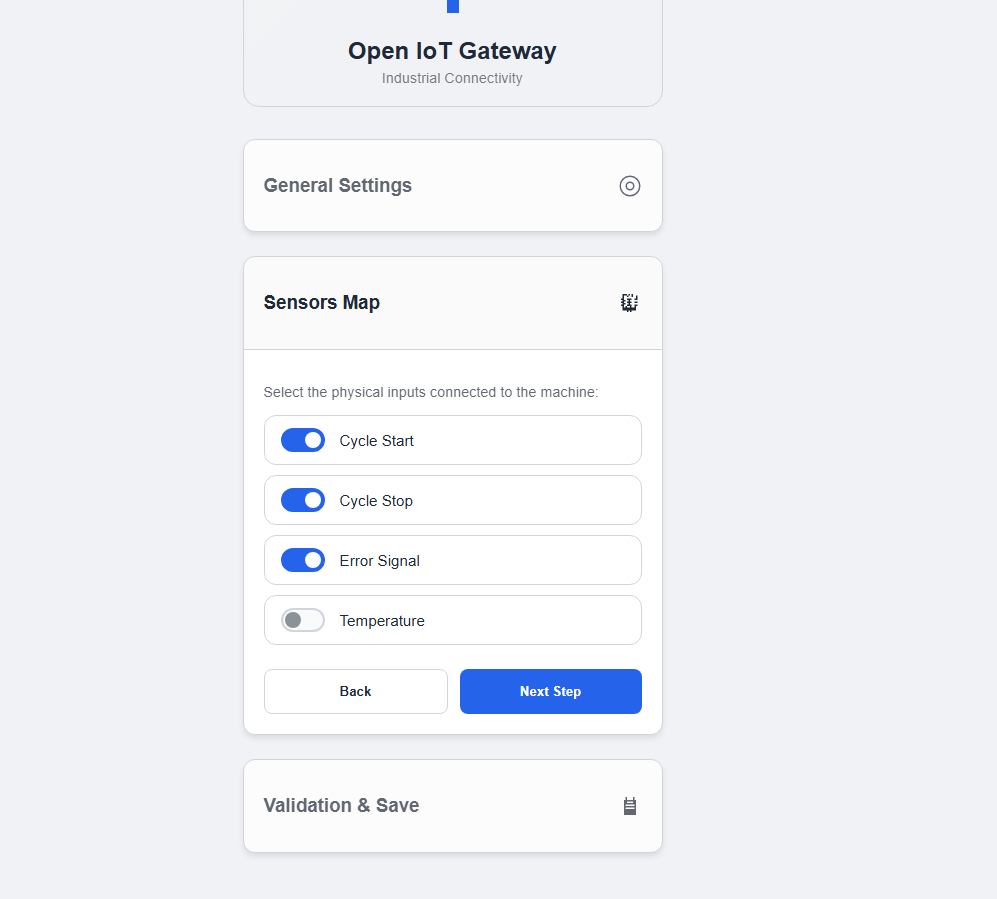
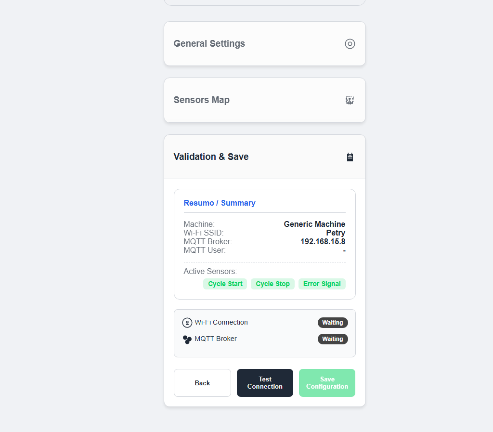
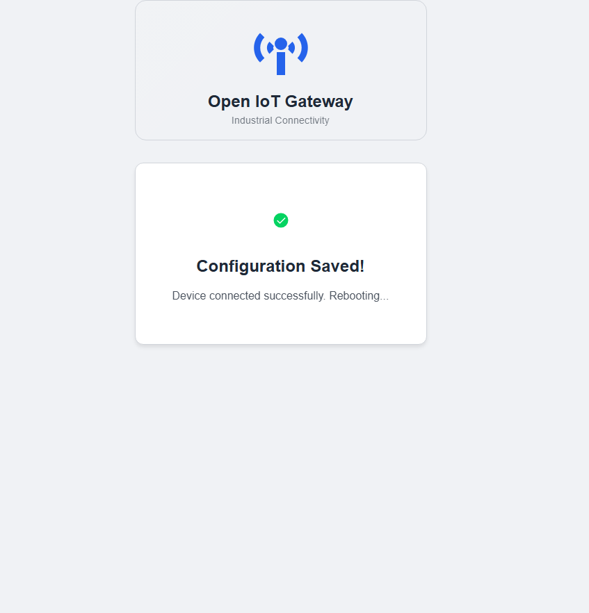
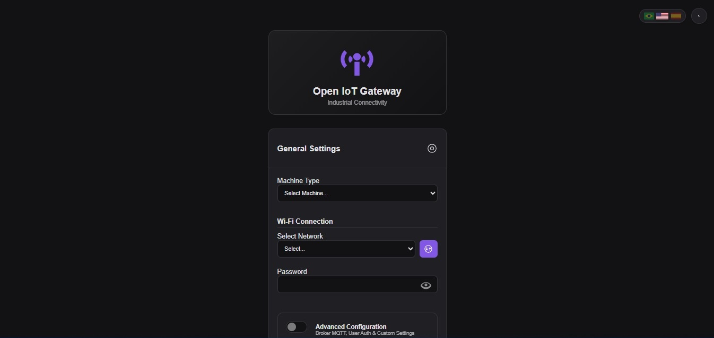
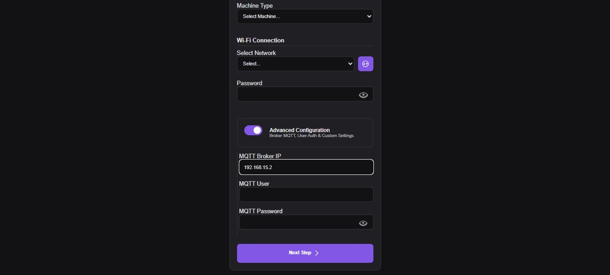
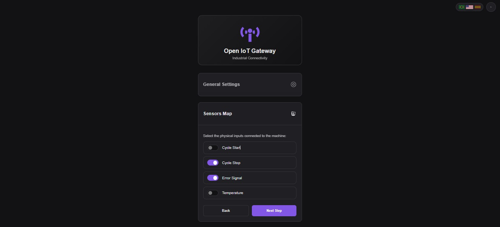
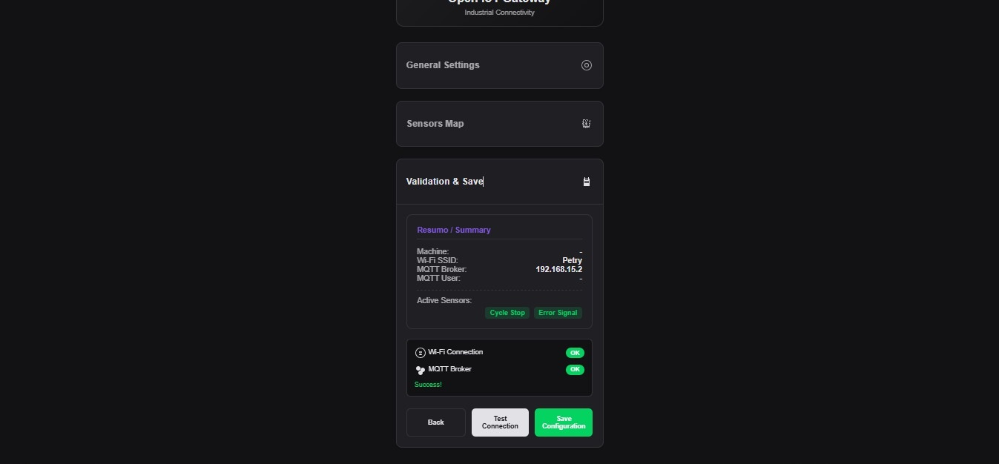
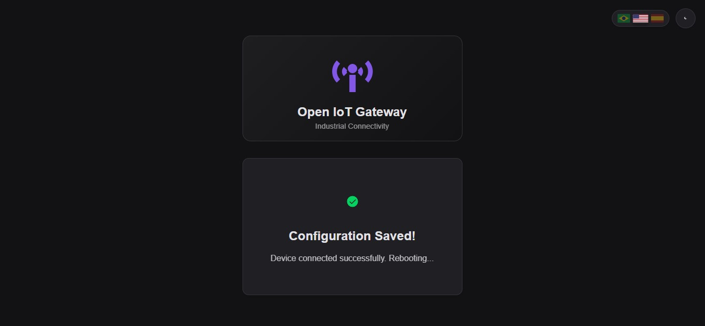

# Open IoT Gateway Firmware


## Overview

This repository contains the firmware for an ESP32-based Industrial IoT Gateway. The system acts as a bridge between physical industrial signals (Digital/Analog I/O) and IT protocols (MQTT/HTTP), designed for Industry 4.0 applications.

The firmware includes an embedded web server hosting a Single Page Application (SPA) for configuration, eliminating the need for hardcoded credentials. Configuration data is persisted in the ESP32 Non-Volatile Storage (NVS).

## Interface Gallery

The embedded web interface is responsive and supports high-contrast themes for industrial environments.

### Light Theme
| 1. Dashboard | 2. General Config | 3. Sensors Map |
| :---: | :---: | :---: |
|  |  |  |

| 4. Validation | 5. Success | |
| :---: | :---: | :---: |
|  |  | *Full configuration flow* |

### Dark Theme
| 1. Dashboard | 2. General Config | 3. Sensors Map |
| :---: | :---: | :---: |
|  |  |  |

| 4. Validation | 5. Success | |
| :---: | :---: | :---: |
|  |  | *High contrast mode* |

## Features

- **Network Management**: Automatic failover between Station Mode (STA) and Access Point (AP) for initial provisioning.
- **MQTT Telemetry**: Real-time publishing of I/O states and sensor data using JSON payloads.
- **MTConnect Proxy**: HTTP client capability to fetch data from CNC machines and relay to MQTT.
- **Embedded Web Interface**: Responsive configuration dashboard stored in LittleFS (HTML5/CSS3/JS).
- **Hardware Abstraction**: Decoupled I/O logic via `IOController` class.
- **System Safety**: Physical factory reset via long-press on the BOOT button.

## Hardware Requirements

- **Microcontroller**: ESP32 DevKit V1 (or compatible ESP32-WROOM-32 board).
- **Peripherals**:
  - Digital Inputs: Optocoupled inputs (active low/high configurable).
  - Analog Inputs: 0-10V or 4-20mA conditioning circuits.
  - Status LED: GPIO 2 (Onboard).

## Development Environment

The project is structured for **PlatformIO**.

- **IDE**: VS Code
- **Framework**: Arduino
- **Platform**: Espressif 32

### Dependencies
All dependencies are managed via `platformio.ini`:
- `PubSubClient` (MQTT)
- `ArduinoJson` (Serialization)

## Installation and Flashing

### 1. Clone the repository
```bash
git clone [https://github.com/petry-dev/Open-IoT-Gateway-Firmware.git](https://github.com/petry-dev/Open-IoT-Gateway-Firmware.git)
cd Open-IoT-Gateway-Firmware
